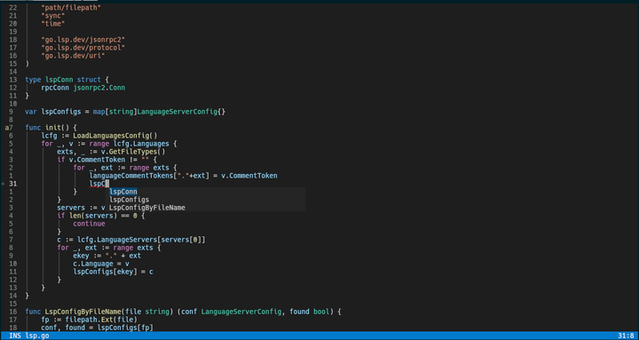

# Vig (written in Go)

**Vig** is a modal, Vim‑like text editor written in Go, forked from the excellent [Wig](https://github.com/wig-editor/wig) project.  
It builds upon Wig’s solid foundation with a **focus on stability, core Vim operations, and a clean daily‑driver experience**.

<p align="center">
  
</p>

---

## ✨ Features

Vig implements a wide range of Vim‑style editing capabilities, many inherited from Wig and further refined:

- **Modes** – Normal, Insert, Visual, Visual Line, Visual Block.
- **Core Editing** – Insert, delete, yank, put, undo/redo, auto-indent, comment toggling, and repeat with `.`.
- **Motions & Navigation** – Standard Vim motions (`h/j/k/l`, `w/b/e`, `0/$`, `%`, `f/F/t/T`), EasyMotion, marks, and scroll.
- **Search & Replace** – Incremental search with live highlighting, project-wide search via ripgrep, and substitution with real‑time preview.
- **File & Buffer Management** – Open/save, buffer picker, MRU, file picker, command palette, and CLI support.
- **Window Management** – Splits (vertical/horizontal), window cycling, closing, and layout toggling.
- **Git Integration** – Status panel with staging, diff, commit, push, stash management, hunk navigation, inline blame, and AI‑generated commit messages.
- **LSP Support** – Autocompletion, go to definition, hover docs, signature help, diagnostics, and quickfix list.
- **Syntax Highlighting** – Tree‑sitter for Go, Rust, Odin, C, Python, Bash, JSON, TOML, and custom query support.
- **UI & Interaction** – Statusline, notifications, Which‑Key, command line, popups, and autocomplete navigation.
- **Registers & Macros** – Named registers, clipboard, macro recording/playback, and dot repeat.
- **Configuration** – TOML configuration for themes, line numbers, format-on-save, LSP, leader key, and more.
- **Visual Block** – Rectangle selection, block insert, yank, and delete.
- **System Integration** – System clipboard, bracketed paste, position cache, and CLI flags.

---

## 🚀 Getting Started

### Build & Run

```bash
make setup-runtime
make build-run
```

Then edit your configuration file (it will be created automatically if missing):

```bash
vim ~/.config/vig/config.toml   # or use vig's built‑in `:config` command
```

### Dependencies

- Go 1.21+
- Tree‑sitter parsers (fetched via `make setup-runtime`)
- ripgrep (for project search)
- Git (for git features)

---

## ⌨️ Keybindings

Most common Vim keybindings are implemented. Here are some highlights:

| Key                | Description                         |
|--------------------|-------------------------------------|
| `Tab` / `Shift-Tab`| Next / previous item in popup       |
| `Space + f`        | Find files in Git project           |
| `Space + b`        | Show buffers                        |
| `Space + s + s`    | Fuzzy text search                   |
| `Space + `` ` ``   | Toggle between two files            |
| `Space + /`        | Search text in project (ripgrep)    |
| `gcc`              | Toggle comment on current line      |
| `gc` + motion      | Toggle comment on motion            |
| `]h` / `[h`        | Next / previous git hunk            |
| `<Leader>t`        | Change theme                        |
| `<Leader>i`        | Toggle indent guides                |
| `gd`               | Go to definition                    |

For a complete list, see `config/config.go` or use the built‑in **Which‑Key** helper (press `<Leader>` to trigger).

---

## 🙏 Acknowledgements

Vig would not exist without the incredible work of the **Wig** community.  
We are deeply grateful to all [Wig contributors](https://github.com/wig-editor/wig/graphs/contributors) for creating such a solid and inspiring editor.

<a href="https://github.com/wig-editor/wig/graphs/contributors">
  
</a>

Vig aims to carry forward Wig’s vision while focusing on **stability, reliability, and a familiar Vim experience** for daily use.  
Special thanks to everyone who has contributed to Vig directly – your feedback and patches are invaluable.

---

## 📖 More Information

- **Plans** – Vig will continue to polish core features, improve performance, and add user‑requested enhancements while keeping the editor lightweight and fast.
- **Issues / Contributions** – Please report bugs and send pull requests on our GitHub repository. We welcome contributions of all kinds!

Happy editing! 🖊️
